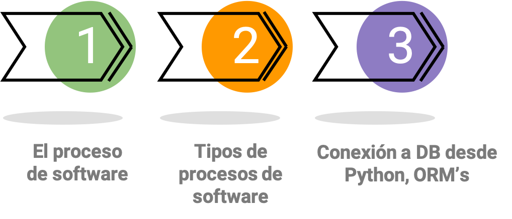
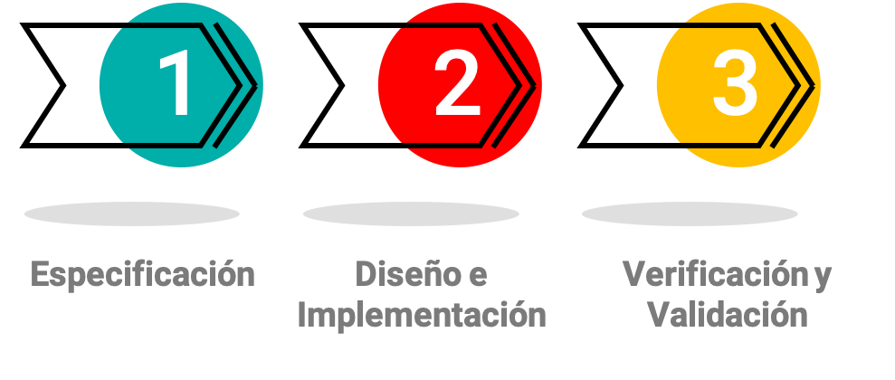
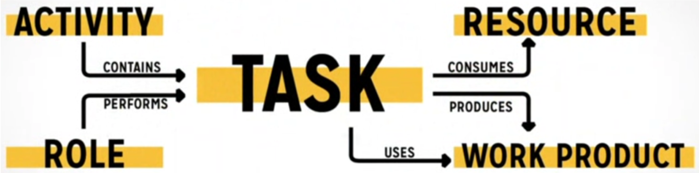
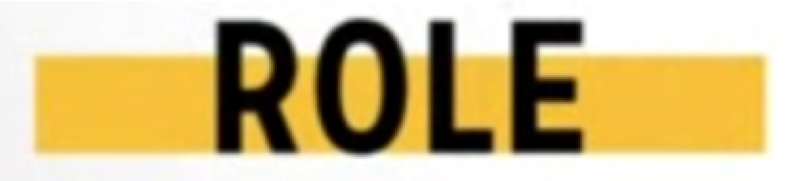
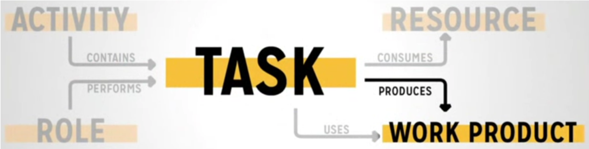

# Unidad 3: Modelos de procesos de software

## Contenido de la unidad



---

## Procesos de Software

También llamados los ciclos de vida del software, son metodologías para el desarrollo de software de manera sistematizada y en equipo.


**Permiten estructurar y medir el avance de un proyecto**




En rasgos generales el proceso de desarrollo de software contempla grandes etapas, 

* **Especificación** en la que se toman los requerimientos, se definen los objetivos del proyecto, las fases y el plan de trabajo
* **Diseño e implementación** es la etapa de codificar las funciones, módulos, versiones del software (es la etapa de programar)
* **Verificación y validación** es la etapa de retroalimentación por parte de los tester, de los usuarios para validar lo que se implementa.

---


### Conceptos a conocer de un proceso de software


En cada proceso se maneja la misma convención.

Para los proyectos:

* Todo se organiza por **fases** (objetivo general), que son etapas específicas acumulativas.
* Cada fase cuenta con **actividades** (objetivos específicos) generales que describen los objetivos que se desean cumplir en esa fase.
* Cada actividad cuenta con **tareas**, unidades muy específicas a realizar que no toman más de un día en realizarse. son la unidad más granular del proceso de software.

#### Ejemplo para una tarea específica



Este es un ejemplo en el que se ve como es la estructura para una tarea específica

1. una actividad contiene tareas
2. un Rol determinado desarrolla esa tarea
3. una tarea consume recursos -> (tiempo, dinero, tecnología)

```{note}
Una **TAREA** usa productos, los productos son documentos o resultados de las fases iniciales, puede ser un documento de requerimientos, el diseño de una arquitectura,etc.

y a su vez la **TAREA** genera nuevos productos: una funcionalidad, un documento de reporte de pruebas, etc

```

::::{dropdown} ¿Qué cosas se consideran una tarea?


* Escribir una pieza de código de software
* Diseñar una característica
* Escribir documentación
* Instalación de una librería
* Probar una función

::::

::::{dropdown} Roles dentro de un equipo de desarrollo de software



* Programador (También se le llama desarrollador)
* Tester (Se le denomina QA, Quality Assurance)
* CEO (Gerente de la compañía, Chief Executive Officer)
* Cliente (Cliente final - no confundir con el usuario final -)
* Gerente de proyecto ( Conocido como project manager)

:::{warning}
Se debe mencionar que, aunque estos son diferentes a los roles del desarrollo en equipo, para la metodología TSP se definen otros nombres de roles.
Estos son solo un ejemplo de los roles que están involucrados, no son los únicos y no son el único nombre que pueden tener.
:::
::::

::::{dropdown} Productos / artefactos
    


| Producto | Recursos |
| --- | --- |
|* Diseños|* Tiempo|
|* Requisitos|* Dinero|
|* Código fuente|* Tecnología|
|* Casos de prueba|* Conocimiento|
|* Documentación interna|* Personal (Talento Humano)|

)

##### Ejemplos de productos / artefactos y recursos


::::


## Tipos de procesos de software
