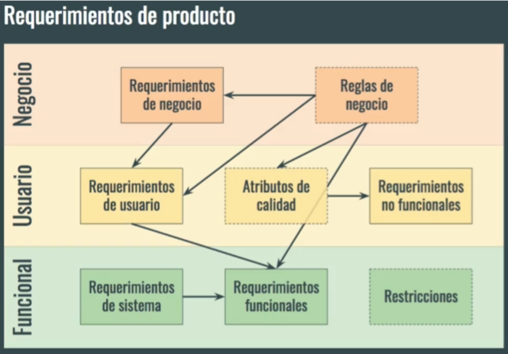

(Nivel_requisitos)=
## Niveles de requisitos



* **Negocio:** ¿Por qué se está implementando el sistema?. Objetivos generales de la organización o los clientes.
* **Usuario:** Lo que el usuario podrá hacer con la aplicación. Funciones del usuario en su trabajo.
* **Funcionales:** Lo que el desarrollador debe construir. Funciones detalladas del sistema.

---

### Ejemplos de niveles de requisitos:

**Requisito del negocio:** Aumentar en un 15 % la cantidad de estudiantes que participan en semilleros de investigación

**Requisito del usuario:** Los estudiantes podrán consultar semilleros de investigación por área

**Requisito del software:**

* El sistema validará que el área tenga semilleros activos (o muestra mensaje de error).
* El sistema consultará los semilleros activos del área, y de cada uno mostrará nombre y 100 caracteres de la descripción. Se mostrarán hasta 20 semilleros por página.

---

## Lo que NO es un requisito

* Detalles de diseño o de implementación (el “cómo”).
* Información sobre pruebas.
* Información sobre planeación.
  * Presupuesto .
  * Tiempos del proyecto.

---

```{note} 

_**Ejercicio para discusión rápida**_
Determine si es un requisito o no:

* El sistema deberá permitir el registro de nuevos usuarios.
* El sistema se desarrollará en Python.
* El sistema deberá mostrar los resultados de cada consulta en menos de 3 segundos.

```

---